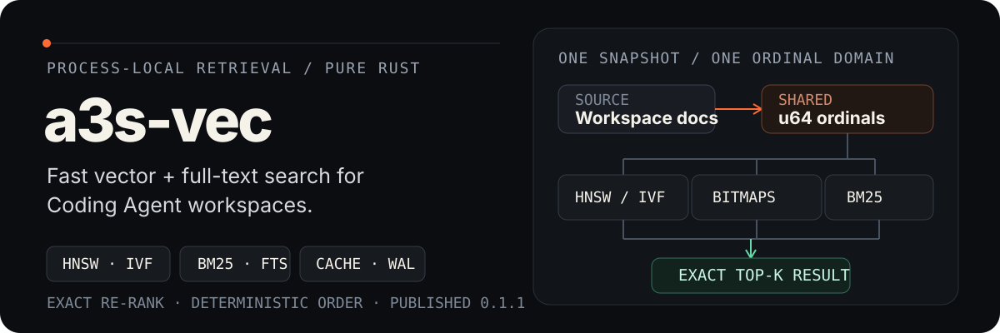

<p align="center">
  
</p>

`a3s-vec` is a native Rust, process-local retrieval engine for Coding Agent
workspaces. It combines dense and sparse vectors, scalar filtering, and BM25
inside one durable collection—without a server process or a C/C++ runtime.

The project is an active prototype. HNSW, IVF with optional SOAR assignment,
HNSW/IVF RaBitQ, metric-aware Vamana,
product-quantized DiskANN with typed positioned or immutable mmap-snapshot traversal,
scalar inverted indexes, and FTS are live;
exact execution remains the correctness oracle whenever an index is missing,
stale, or not selective enough.

[Architecture](ARCHITECTURE.md) · [Roadmap](ROADMAP.md) ·
[Reproducible benchmarks](BENCHMARKS.md) ·
[Release qualification](RELEASE.md)

## What it delivers

| Need | Current implementation |
| --- | --- |
| Local semantic retrieval | Dense and sparse exact search, HNSW, IVF/SOAR, HNSW/IVF RaBitQ, metric-aware Vamana, PQ/ADC DiskANN, and exact re-ranking |
| Workspace text search | BM25, Unicode n-grams, boolean groups, wildcard/fuzzy/range terms, ordered phrase proximity, boosts, and token filters |
| Structured narrowing | Typed scalar indexes, range/null/IN/wildcard predicates, and bitmap prefiltering |
| Durable embedding | WAL, checksummed snapshots, manifest commits, file locking, a validated derived-index cache, and a Vamana/DiskANN sector sidecar |
| Predictable failure | Typed validation errors and exact fallbacks instead of silent approximation |

## A3S Code integration

The engine is now consumed by A3S Code through a session-local migration shadow.
Code commit [`4163d8e3`](https://github.com/A3S-Lab/Code/commit/4163d8e3a1a96bbae430dc987005acaa362efb30)
pins Vec commit [`019fdb929`](https://github.com/A3S-Lab/Vec/commit/019fdb929a57dee1803691e6def60df3946d9561).
The adapter mirrors each already-admitted embedding batch once into a temporary
collection and compares the Vec result with the A3S Memory result, while Memory
remains the only serving authority. Shadow failures are isolated and surfaced
as bounded diagnostics; they cannot change public retrieval results. The
complete ownership, mapping, resource, and rollback contract is documented in
[Code's migration note](https://github.com/A3S-Lab/Code/blob/main/manual/WORKSPACE_RETRIEVAL_VEC_MIGRATION.md).

The current engine and feature-matrix evidence in this repository are at
[`9ed701a`](https://github.com/A3S-Lab/Vec/commit/9ed701ae72e45f7b8f7be9c7db943ed4b64f93f4),
with the complete hosted gate recorded in
[CI run 33686399240](https://github.com/A3S-Lab/Vec/actions/runs/33686399240).
Code intentionally keeps the older `019fdb929` shadow pin until its promotion
workflow is qualified against the newer engine revision.

All vector, scalar, and FTS indexes share one revisioned `u64` ordinal domain.
That lets the planner compose bitmaps and candidates without building
query-sized primary-key maps, then resolve only the exact top-k documents.

## Measured proof

`cargo bench --bench structured_fts` builds 25,000 workspace-shaped documents
and checks every indexed result and public score bit against scan execution.
The second of two consecutive post-change runs on the current development
machine produced:

| Query | Planner path | Candidates/query | Latency/query |
| --- | --- | ---: | ---: |
| Selective phrase | Indexed | 1 | 7.38 µs |
| Selective required + optional | Indexed | 1 | 4.62 µs |
| Selective wildcard | Indexed | 1 | 26.55 ms |
| Selective fuzzy | Indexed | 36 | 33.81 ms |
| Selective exact range | Indexed | 1 | 429.62 µs |
| Selective proximity | Indexed | 1 | 7.62 µs |
| Explicit scan controls | Scan | 25,000 | 38.07–98.36 ms |
| Common phrase | Automatic scan fallback | 25,000 | 40.81 ms |
| Broad boolean + NOT | Automatic scan fallback | 25,000 | 43.19 ms |

Five selective cases reduce scored candidates by 25,000×; fuzzy expansion
reduces them from 25,000 to 36. Wildcard and fuzzy queries include a vocabulary
expansion pass, while broad structured queries deliberately switch to the exact
scan path when candidate-set work is unlikely to pay for itself. These are
local regression measurements—not a cross-project zvec benchmark. Full
methodology and repeated observations live in [BENCHMARKS.md](BENCHMARKS.md).
The public API release gate is the deterministic [feature matrix](BENCHMARKS.md#public-feature-matrix-and-performance-gate),
which checks every query route and reports p50/p95/p99 latency for the sync,
ANN, sidecar, mutation, and Tokio paths. The companion
[concurrent-reader and mixed-workload fixtures](BENCHMARKS.md#mixed-readwrite-contention)
gate read contention, read/write contention, Recall@10, QPS, and logical
accounting on the same revision. The lifecycle matrix additionally measures
management operations, resource admission, and maintenance ownership. The CI
platform matrix repeats all five smoke benches on Linux x86/ARM, Windows x86, and macOS ARM/Intel; its hosted
Intel result is portability evidence, not the required macOS 12 runtime gate.
For a larger same-host engine comparison, use the [scale harness](BENCHMARKS.md#larger-corpus-scale-comparison),
which drives a3s-vec and an opt-in zvec companion with the same deterministic
corpus and reports build time, p50/p95/p99, QPS, and Recall@10.

## Quick start

The A3S monorepo consumes this repository as `crates/vec`. Until a crate
release is published, use a path dependency from the monorepo root:

```toml
[dependencies]
a3s-vec = { path = "crates/vec" }
```

This complete example creates a durable FTS collection, inserts one workspace
document, and executes a structured query:

```rust
use a3s_vec::{
    Collection, CollectionSchema, DataType, Doc, FieldSchema, Fts, IndexParams,
    Result, SearchQuery,
};

fn main() -> Result<()> {
    let mut body = FieldSchema::new("body", DataType::String, false, 0)?;
    body.set_index_params(&IndexParams::fts(Some("standard"), None, None)?)?;
    let schema = CollectionSchema::builder("workspace")
        .add_field(body)
        .build()?;

    let collection = Collection::create("./workspace-index", &schema, None)?;
    let mut doc = Doc::with_pk("src/index.rs")?;
    doc.add_string("body", "Rust vector database for workspace retrieval")?;
    collection.insert(&[&doc])?;

    let mut expression = Fts::new()?;
    expression.set_query_string("rust AND \"vector database\"")?;
    let query = SearchQuery::fts("body", &expression, 10)?;
    let hits = collection.query(&query)?;

    assert_eq!(hits[0].get_pk(), Some("src/index.rs"));
    Ok(())
}
```

Tokio applications can opt into scheduler-safe query methods without making
the core collection runtime-dependent:

```toml
[dependencies]
a3s-vec = { path = "crates/vec", features = ["async"] }
```

```rust
use a3s_vec::{Collection, Doc, Result, SearchQuery};

async fn search(collection: &Collection, query: &SearchQuery) -> Result<Vec<Doc>> {
    collection.query_async(query).await
}
```

`query_async`, `multi_query_async`, and `group_by_async` require an active
Tokio runtime and execute the complete synchronous snapshot, planner,
sidecar-I/O, fallback, and exact-refinement path on its blocking pool. They
produce the same results and telemetry as their synchronous counterparts; the
feature is an executor-safety boundary, not a latency claim. Tokio cannot
cancel `spawn_blocking` work after it starts, so dropping one of these futures
does not cancel its underlying query.

## Executable compatibility examples

The [`examples`](examples/README.md) directory is part of the regression
surface. The upstream CRUD, vector-search, and schema-builder fixtures track
`zvec-ai/zvec-rust@0d40cb1aef081bae175061fef35c89269e6a80f4` with only the
crate namespace changed; their executable wrappers add only local lint
allowances. Asserted project-owned binaries cover vector/FTS and hybrid
retrieval, grouped top-k, isolated iteration, durable schema evolution, and
maintenance health. CI runs every binary instead of only checking that it
compiles:

```text
cargo run --locked --example crud_operations
cargo run --locked --example vector_search
cargo run --locked --example schema_builder
cargo run --locked --example retrieval_workflows
cargo run --locked --example group_by
cargo run --locked --example schema_iteration
cargo run --locked --example maintenance_health
```

The pinned upstream CRUD fixture contains two incomplete replacement upserts;
both official zvec and `a3s-vec` reject them because the required `id` field is
absent. This known upstream fixture defect is preserved so the namespace-only
claim remains auditable. The asserted A3S-owned examples fail on any incorrect
result.

## Retrieval capabilities

### Vectors and indexes

- Dense FP16, FP32, FP64, INT4, INT8, INT16, Binary32, and Binary64 payloads.
- Sparse FP16 and FP32 payloads.
- Dense, sparse, and packed-binary queries accept either an explicit payload
  or a source document ID. Source-ID queries use the same exact scoring,
  filtering, radius, projection, persistence, and optional Tokio execution
  paths; Binary32 and Binary64 are covered independently through each route.
- Binary32 and Binary64 exact searches use L2 over bit coordinates: the exposed
  score is the negative XOR Hamming count. Flat L2 is supported; other binary
  metrics and binary ANN indexes return `NotSupported`.
- `SearchQuery::builder()` supports a dense, packed-binary, or pure FTS
  `query_string`/`match_string` route and rejects ambiguous combinations;
  `include_doc_id` exposes the generation ordinal for returned query documents.
- Exact numeric L2, inner product, cosine, and MIPS-L2 scoring plus binary
  L2/Hamming scoring, all with `f64` ranking intermediates.
- Native HNSW and IVF candidate generation with exact full-vector re-ranking;
  IVF optionally assigns every base vector to a primary centroid and one
  orthogonality-aware SOAR secondary centroid.
- Portable HNSW/IVF RaBitQ with deterministic random rotation, compact
  1-to-9-bit codes, bounded refinement, and exact full-vector re-ranking.
- Deterministic two-pass metric-aware Vamana construction (L2, inner product,
  cosine, and MIPS-L2), bounded `list_size` search, incremental overlays, and
  exact full-vector re-ranking.
- Deterministic product-quantizer training with up to 256 centroids per chunk,
  one-byte codes, query-local ADC tables, and exact full-vector re-ranking.
- Native 4 KiB-sector Vamana/DiskANN files with fixed full-vector or PQ-code
  records, CRC validation, bounded positioned reads or immutable anonymous mmap
  snapshots, and failure-closed in-memory fallback.
- Index-only FP16, symmetric INT8, and symmetric INT4 quantization.
- Scalar inverted indexes for equality, range, `IN`, null, wildcard, prefix,
  suffix, and boolean filter composition.

Vamana accepts unquantized L2, inner-product, cosine, and MIPS-L2 vectors.
`IndexParams::diskann` uses the same metric-aware deterministic graph and
enables corpus-trained PQ when `pq_chunk_num > 0`; zero selects full-vector
graph scoring. A freshly built or rebuilt generation
traverses in memory. After a validated cache reopen, bounded queries use
portable positioned reads by default and retain a request-local sector/node
cache. `IoBackend::Mmap` instead copies the already validated sidecar into a
read-only anonymous memory map at open time and serves the same bounded extents
from that immutable snapshot. PQ queries build one metric-aware ADC table and
sum code similarities or distances during graph traversal. Incremental overlays share the
reader; a full rebuild retrains the codebook and invalidates the reader until
the next validated reopen. A short read or malformed record falls back to the
equivalent in-memory full-vector or ADC graph, and authoritative vectors still
perform final re-ranking. The file is an A3S-native format, not the Microsoft
DiskANN C++ format. The mmap snapshot is independent of later replacement or
truncation of the source file, but open performs a full sidecar copy and keeps
that additional memory for the handle's lifetime. The optional Tokio entry
points keep either backend off runtime workers; native async file reads and
direct file-backed mmap remain future accelerators.

Select mmap for one collection handle with a typed option:

```rust
use a3s_vec::{Collection, CollectionOptions, IoBackend, Result};

fn open_with_mmap(path: &str) -> Result<Collection> {
    let mut options = CollectionOptions::new()?;
    options.set_io_backend(IoBackend::Mmap)?;
    Collection::open(path, Some(&options))
}
```

The same query control selects the bounded list size for both index types:

```rust
use a3s_vec::{DiskannQueryParams, IndexParams, MetricType, Result, SearchQuery};

fn configure_diskann_pq(query: &mut SearchQuery) -> Result<IndexParams> {
    query.set_diskann_params(DiskannQueryParams::new(64))?;
    IndexParams::diskann(MetricType::L2, 32, 96, 8)
}
```

RaBitQ is a separate HNSW/IVF index family. It trains deterministic centers,
applies a four-round signed Hadamard rotation, and uses the compact code only
for candidate traversal or refinement. The authoritative vector remains the
source of public scores. HNSW defaults to seven bits and 16 centers; the typed
options constructor exposes bit width, center count, and sample count. IVF
uses `scale_factor * topk` as the bounded exact-refiner set:

```rust
use a3s_vec::{
    IndexParams, IvfRabitqQueryParams, MetricType, Result, SearchQuery,
};

fn configure_rabitq(query: &mut SearchQuery) -> Result<IndexParams> {
    let mut controls = IvfRabitqQueryParams::new(8, 0.0, false, true);
    controls.set_scale_factor(8.0)?;
    query.set_ivf_rabitq_params(controls)?;
    IndexParams::ivf_rabitq(MetricType::Cosine, 64, 7, 1_000)
}
```

Vamana graph saturation/occlusion tuning and standalone Vamana quantization
remain explicit unsupported controls until they have verified execution
implementations. Binary ANN and Alibaba's C++ wire format remain separate,
documented boundaries. The exact binary route is an A3S extension based on
zvec's former binary squared-Euclidean/Hamming semantics; Alibaba removed its
Hamming metric in [zvec PR #365](https://github.com/alibaba/zvec/pull/365), so
this project does not claim current upstream binary-query compatibility.

### Full-text search

The FTS pipeline analyzes documents and queries with the same ordered tokenizer
and filter configuration.

| Component | Supported values |
| --- | --- |
| Tokenizer | `standard`, `whitespace`, Unicode `ngram`, optional `jieba` / `jieba_accurate` |
| Token filter | `lowercase`, `ascii_folding`, `stemmer` |
| Query syntax | `AND`, `OR`, `NOT`, parentheses, `+` required, `-` prohibited, escapes, `*` / `?` wildcards, same-field qualifiers, `^` boosts, fuzzy terms, ordered phrase slop, and term ranges |
| Default operator | `OR` for compatibility, or explicit `AND` |

Omitting `filters` selects `lowercase`. Passing an explicit empty slice keeps
the standard, whitespace, and n-gram tokenizer output case-sensitive. Filters
run in declaration order on both indexed text and query text.

```rust
use a3s_vec::{IndexParams, Result};

fn workspace_text_index() -> Result<IndexParams> {
    IndexParams::fts(
        Some("standard"),
        Some(&["lowercase", "ascii_folding", "stemmer"]),
        Some(r#"{"max_token_length":255,"stemmer_lang":"english"}"#),
    )
}
```

The Snowball stemmer supports Arabic, Danish, Dutch, English, Finnish, French,
German, Greek, Hungarian, Italian, Norwegian, Portuguese, Romanian, Russian,
Spanish, Swedish, Tamil, and Turkish. ASCII folding uses Unicode decomposition
plus common Latin compatibility mappings; it is not advertised as byte-for-byte
equivalent to every zvec folding table.

The n-gram tokenizer defaults to Unicode bigrams. `ngram_min`,
`ngram_max`, and `token_chars` configure its range and accepted Unicode
character classes:

```rust
use a3s_vec::{IndexParams, Result};

fn identifier_index() -> Result<IndexParams> {
    IndexParams::fts(
        Some("ngram"),
        None,
        Some(
            r#"{"ngram_min":2,"ngram_max":3,"token_chars":["letter","digit"]}"#,
        ),
    )
}
```

For selective identifier/path queries, `default_operator=AND` starts from the
shortest posting. Structured expressions build exact boolean candidate sets;
phrases verify ordered proximity only for candidates. The planner falls back to
scan execution for broad expressions and keeps indexed refinement when a scalar
prefilter is available.

Wildcard (`rust*`, `r?sty`), fuzzy (`rust~1` or `rust~2`), and range
(`[alpha TO omega]`, `{alpha TO omega}`) leaves expand once against the analyzed
term vocabulary. `*` is an unbounded range endpoint. Fuzzy terms, range bounds,
and wildcard literal fragments must each analyze to one term, and range
comparison is over the resulting lexicographic term order. A qualifier such as
`body:rust` must name the field already selected by `SearchQuery::fts`;
cross-field execution is rejected. Boosts are finite values in
`(0, 1_000_000]`.

Quoted phrases accept an explicit slop from 0 through 1,024, for example
`"vector engine"~2`. Slop counts the total intervening tokens while preserving
term order; it does not enable transpositions. Both indexed and scan execution
use these same expansion, BM25, and proximity rules. Symbolic `&&` and `||`
aliases remain explicitly unsupported.

## How execution stays exact

```text
request
  → capture one immutable schema/document/index revision
  → validate route, type, dimension, limits, and syntax
  → derive scalar and FTS candidate ordinals when selective
  → run HNSW/IVF/RaBitQ/Vamana/DiskANN or the exact vector path
  → verify filters and phrases against authoritative documents
  → exact-score, deterministic top-k, projection, and optional fusion
```

- Flat vector and scan BM25 execution are always available as reference paths.
- Every derived index generation is immutable and tagged with its source
  revision.
- HNSW/IVF/RaBitQ/Vamana/DiskANN candidates are re-ranked with authoritative
  vectors.
- Indexed and scan FTS share `f64` corpus/scoring primitives and produce
  bit-identical public scores in differential fixtures.
- Equal scores use ascending primary key as the deterministic tie-break.

## Persistence and recovery

Documents, snapshots, and WAL records are authoritative. The current storage
format is version 4: checksummed MessagePack snapshots plus a manifest-committed
WAL boundary. Version-3 JSON snapshots remain readable and upgrade at the next
writable checkpoint.

ANN, scalar, FTS, and the shared ordinal table are persisted separately as a
non-authoritative derived cache. Cache format 10 includes RaBitQ rotations,
centers, compact codes, Vamana/DiskANN graphs, PQ codebooks/codes, parsed
tokenizer, and ordered filter state. A Vamana or
DiskANN generation additionally
requires `indexes/diskann-graph.bin`: an A3S-native 4 KiB-sector mirror bound to
the same revision, schema digest, and manifest identity. Its header, metadata,
padding, full vectors or PQ codes/codebooks, graph edges, and CRC are validated
before a cache hit. A missing, stale, corrupt, structurally invalid, or pre-v10
cache/sidecar pair
is ignored and rebuilt from recovered documents; read-only opens never repair
it.

The public API supports read-only handles, configurable durability and sidecar
I/O, explicit `flush`, targeted `rebuild_index`, whole-registry `optimize`, and
per-handle cache-hit/query/candidate plus DiskANN backend/sector-read telemetry.

## Resource limits and accounting

Resource policy is a typed, collection-local option captured when a handle is
created or opened:

```rust,no_run
use a3s_vec::{CollectionOptions, CollectionResourceLimits, Result};

fn bounded_options() -> Result<CollectionOptions> {
    let limits = CollectionResourceLimits::new()
        .try_with_max_documents(100_000)?
        .try_with_max_accounted_bytes(512 * 1024 * 1024)?
        .try_with_max_query_candidates(50_000)?
        .try_with_max_write_batch_documents(1_000)?;
    let mut options = CollectionOptions::new()?;
    options.set_resource_limits(limits)?;
    Ok(options)
}
```

`max_documents` and `max_accounted_bytes` are checked before a new collection
generation is published or appended to the WAL. Accounted bytes are the
deterministic bincode size of the authoritative document map plus the derived
index payload estimates reported by index statistics. They do not claim to
measure allocator overhead, temporary construction peaks, mapped files, or
process RSS. A deletion that would grow a tombstone overlay first compacts the
derived generation so deletion remains a practical way to recover capacity.

`max_query_candidates` bounds the planned exact/refinement candidates for one
query; multi-query branches share one cumulative budget. It does not represent
a wall-clock deadline or include every planner/index lookup. The write-batch
limit applies to insert, update, upsert, explicit delete inputs, and the matched
set of a filtered delete. A rejected generation is atomic and does not advance
the revision. `stats` and `stats_snapshot` expose the active policy, document
and index accounting, total accounted bytes, and a metadata-only rejection
counter; rejected query text and documents are never recorded.

## Health and background maintenance

`Collection::health` reports an explicit `healthy`, `degraded`, `unhealthy`,
or `closed` state. It checks the in-memory revision against the committed
storage revision and requires every configured derived index to be ready,
complete, and sourced from that revision. WAL operations waiting for a
checkpoint are reported separately because they are normal under interval or
manual durability and do not make an otherwise recoverable collection
unhealthy.

Collection construction never starts a hidden thread. A writable collection
can opt into one explicitly owned standard-thread scheduler:

```rust,no_run
use a3s_vec::{Collection, CollectionMaintenanceOptions};
use std::time::Duration;

fn start(collection: &Collection) -> a3s_vec::Result<()> {
    let options = CollectionMaintenanceOptions::new()
        .try_with_interval(Duration::from_secs(60))?;
    let maintenance = collection.start_maintenance(options)?;
    maintenance.trigger()?;
    let health = maintenance.health();
    assert!(health.worker_alive);
    maintenance.close()?;
    Ok(())
}
```

Each due revision rebuilds the complete derived registry and checkpoints the
same authoritative generation while the writer gate is held; readers continue
using the previous immutable indexes during construction. Unchanged revisions
are skipped. Only one runtime may own a collection schedule, read-only handles
reject it, and `close` or `Drop` wakes and joins the worker before releasing
that ownership claim.

## Current boundaries

| Area | Status |
| --- | --- |
| Flat, HNSW, IVF/SOAR | Implemented; SOAR postings use deterministic primary-plus-secondary assignment and unique-candidate probing |
| HNSW/IVF RaBitQ | Implemented for L2, inner product, and cosine with 1-to-9-bit codes and exact re-ranking |
| Metric-aware Vamana traversal and incremental overlays | Implemented for L2, inner product, cosine, and MIPS-L2 in memory and through positioned or immutable mmap-snapshot sidecar reads after reopen |
| Metric-aware DiskANN PQ/ADC and incremental overlays | Implemented for L2, inner product, cosine, and MIPS-L2 in memory and through positioned or immutable mmap-snapshot PQ-code reads after reopen |
| Sector-aligned native Vamana/DiskANN file | Implemented |
| Scalar inverted index | Implemented |
| BM25 + structured boolean/phrase FTS | Implemented |
| FTS wildcard/field/boost/fuzzy/proximity/range syntax | Implemented with bounded, analyzer-aware semantics |
| Dense/sparse/binary source-ID query | Implemented; missing sources return `NotFound` and missing source payloads return `FailedPrecondition` |
| Collection health and background maintenance | Implemented with explicit ownership, bounded schedules, revision-aware skips, worker diagnostics, and joined shutdown |
| Collection resource admission | Implemented for retained documents/logical bytes, cumulative query candidates, write batches, and metadata-only rejection telemetry |
| DiskANN query reader | Portable positioned reads or a validated immutable anonymous mmap snapshot, plus optional Tokio blocking-pool query entry points; native async file reads and direct file-backed mmap remain roadmap |
| Product quantization / RaBitQ | PQ implemented for DiskANN / RaBitQ implemented for HNSW and IVF |
| Binary vector query execution | Binary32/Binary64 exact L2/Hamming implemented across direct, source-ID, filtered, radius, projection/include-doc-id, multi-query, group-by, persistence, and optional Tokio paths; binary ANN remains unsupported |
| Alibaba C++ binary-format compatibility | Requires an explicit future importer/exporter |

`a3s-vec` follows zvec's Rust vocabulary where it is useful, but it is not a
binary-compatible clone. `zvec-core` remains a private pure-Rust algorithm
dependency; callers use only A3S-owned collection, schema, document, query, and
error contracts.

## Quality gates

Run checks inside this crate:

```sh
cargo fmt --all -- --check
cargo audit --deny unsound
cargo test
cargo test --no-default-features
cargo test --all-features
cargo +1.75.0 test --locked
cargo +1.75.0 test --locked --features async
cargo clippy --all-targets -- -D warnings
cargo clippy --all-targets --all-features -- -D warnings
RUSTDOCFLAGS="-D warnings" cargo doc --no-deps --all-features
cargo test --locked --test feature_matrix
```

Reproducible performance fixtures:

```sh
cargo bench --locked --bench feature_matrix --features async
A3S_VEC_BENCH_SCALE=smoke cargo bench --locked --bench feature_matrix --features async
cargo bench --locked --bench concurrent_queries
A3S_VEC_BENCH_SCALE=smoke cargo bench --locked --bench concurrent_queries
cargo bench --locked --bench mixed_workload
A3S_VEC_BENCH_SCALE=smoke cargo bench --locked --bench mixed_workload
cargo bench --locked --bench scale_compare
A3S_VEC_BENCH_SCALE=smoke cargo bench --locked --bench scale_compare
cargo bench --locked --bench lifecycle_matrix
A3S_VEC_BENCH_SCALE=smoke cargo bench --locked --bench lifecycle_matrix
cargo bench --bench ann_recall
cargo bench --bench filtered_ann
cargo bench --bench scalar_filter
cargo bench --bench fts_index
cargo bench --bench ngram_fts
cargo bench --bench structured_fts
cargo bench --bench reopen_index
```

The default, no-default-feature, all-feature, strict Clippy, rustdoc, and Rust
1.75 gates are maintained separately. The optional Jieba dependency chain
currently requires a newer Cargo because one transitive package uses a Rust
2024 manifest.

## Platform and ownership

The portable correctness path targets Linux x86_64/aarch64, Windows x86_64,
and macOS arm64/x86_64, with macOS 12.0 as the Intel deployment target. It does
not require `io_uring`, a C/C++ runtime, or architecture-specific SIMD.

`a3s-vec` owns retrieval, persistence, and index execution. Workspace
scanning, embedding model runtimes, Agent sessions, and UI policy belong to
their callers. The cross-project boundary is documented in the
[A3S local retrieval platform architecture](https://github.com/A3S-Lab/a3s/blob/main/docs/retrieval-platform-architecture.md).

This repository is `A3S-Lab/Vec`; the A3S monorepo consumes it as the
`crates/vec` submodule. Licensed under [MIT](LICENSE).
